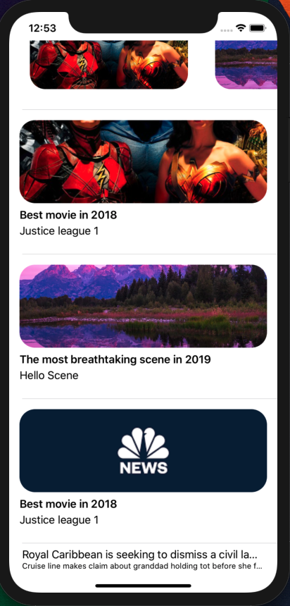
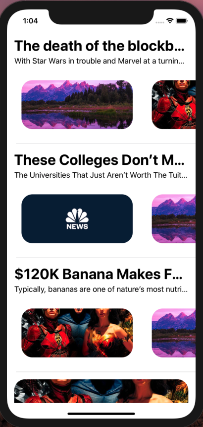

# DUYTableViewController

[](https://travis-ci.org/duycao2506/DUYTableViewController)
[](https://cocoapods.org/pods/DUYTableViewController)
[](https://cocoapods.org/pods/DUYTableViewController)
[](https://cocoapods.org/pods/DUYTableViewController)

## Example

To run the example project, clone the repo, and run `pod install` from the Example directory first.

## Requirements

## Installation

DUYTableViewController is available through [CocoaPods](https://cocoapods.org). To install
it, simply add the following line to your Podfile:

```ruby
pod 'DUYTableViewController'
```

### Step 1:
Add this line at the top of your swift file
```swift
import DUYTableViewController
```
### Step 2:
Create your ViewController View Model, here is where you store your view data, we have an example here: 
```swift
class TestTableViewModel : DUYTableviewViewModel{
    var dataImageTitle : [(String,String,String)] = [
        ("Justice league 1", "Best movie in 2018", "justice"),
        ("Hello Scene", "The most breathtaking scene in 2019", "scene"),
        ("Justice league 1", "Best movie in 2018", "news")
    ]
    
    var dataBasic : [(String, String)] = [
        ("Cruise line makes claim about granddad holding tot before she fell off ship","Royal Caribbean is seeking to dismiss a civil lawsuit filed by the family of Chloe Wiegand, claiming that her grandfather"),
        ("GRANDFATHER WHO DROPPED TODDLER SPEAKS OUT FOLLOWING TRAGIC INCIDENT","An attorney for the Wiegand family said later that month that Anello had held Chloe up to what he believed to be a window, so she could bang on the glass")
    ]
    
    var dataCollection : [(String,String,[String])] = [
        ("The death of the blockbuster: How The Rise of Skywalker marks the end of a cinematic era", "With Star Wars in trouble and Marvel at a turning point, and X-Men, Men in Black and Terminator among the established franchises faltering in 2019, Adam White asks what’s next for the traditional blockbuster", ["scene", "justice"]),
        ("These Colleges Don’t Make The Grade","The Universities That Just Aren’t Worth The Tuition",["news", "scene"]),
        ("$120K Banana Makes For An Expensive Snack","Typically, bananas are one of nature’s most nutritious, delicious, and affordable snacks. At the grocery store",["justice","scene","news"])
    ]
    
    
    
    override func fetchData(){
        /// Sample code
        var tmpArr : [DUYTableViewCellViewModel] = []
        let section = self.getSectionViewModelAt(index: 0)
        for i in 0...dataCollection.count-1{
            let vm = ImageHorizontalListViewModel.init(sectionViewModel: section, tableViewModel: self, section: 0, row: i)
            vm.subTitle = dataCollection[i].1
            vm.mainTitle = dataCollection[i].0
            vm.listImage = dataCollection[i].2
            tmpArr.append(vm)
        }
        for i in 0...dataImageTitle.count-1 {
            let vm = ImageTitleCellViewModel.init(sectionViewModel: section, tableViewModel: self, section: 0, row : i)
            vm.subTitle = dataImageTitle[i].0
            vm.mainTitle = dataImageTitle[i].1
            vm.image = UIImage.init(named: dataImageTitle[i].2)
            tmpArr.append(vm)
        }
        
        for i in 0...dataBasic.count-1{
            let vm = DUYTableViewCellViewModel.init(sectionViewModel: section, tableViewModel: self, section: 0, row : i)
            vm.subTitle = dataBasic[i].0
            vm.mainTitle = dataBasic[i].1
            tmpArr.append(vm)
        }
        
        section.cellViewModelArray = tmpArr
        /// Sample code end
        
    }
}
```


### Step 3:
You create your own ViewController with your own tableView, your ViewController should inherit `DUYTableViewController`, and call `setUpTableView` in viewDidLoad with your ViewModel in Step 2 and your tableView.
```swift
class TestTableViewController: DUYTableViewController {
    @IBOutlet weak var tableView : UITableView!
    override func viewDidLoad() {
        super.viewDidLoad()
        self.setUpTableView(tableViewModel: TestTableViewModel.init(), tableView: self.tableView)
        self.tableViewModel.fetchData()
    }
    //...Your code below
}
```

### Step 4:
Register cells, events, and cell UI properties:
```swift
  override func getRegisteredCells() -> [TableCellRegistration<DUYTableviewCell>] {
        let results : [TableCellRegistration<DUYTableviewCell>] = [
            (classType : ImageTitleTableViewCell.self, isFromXib: true),
            (classType : ImageHorizontalListTableViewCell.self, isFromXib: true)
        ]
        return results
    }
    
    override func setUpBinding() {
        super.setUpBinding()
        self.tableViewModel.onDataChanged = {
            [weak self] vm, section in
            self?.tableView.reloadData()
        }
        
        self.tableViewModel.onRowTap = {
            [weak self] vm, section, row in
            guard let vm = vm as? DUYTableViewCellViewModel else {return}
            self?.showAlert(title: vm.mainTitle, message: vm.subTitle + "\(row)")
        }
    }
    
    override func configureCellViewModel(viewModel: DUYTableviewCellViewModelProtocol, section: Int, row: Int) {
        super.configureCellViewModel(viewModel: viewModel, section: section, row: row)
        switch viewModel {
        case let someVm as ImageTitleCellViewModel:
            let _ = someVm
                .setIdentifierCell(class: ImageTitleTableViewCell.self)
                .setCellHeight(h: 223)
        default:
            return
        }
    }
```

### Step 5:
Create your cells needed for the tableView and let it inherit DUYTableViewCell, implement `setData` function
```swift
  override func setData(viewModel: DUYTableviewCellViewModelProtocol) {
        guard let viewModel = viewModel as? ImageTitleCellViewModel else {return}
        self.lblTitle.text = viewModel.mainTitle
        self.lblSubtitle.text = viewModel.subTitle
        self.imgView.image = viewModel.image
    }
```
### Step 6: 
Check your results, here is my sample result from the example project

 

## Author

duycao2506, duyckhl@gmail.com

## License

DUYTableViewController is available under the MIT license. See the LICENSE file for more info.
